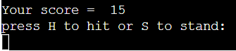
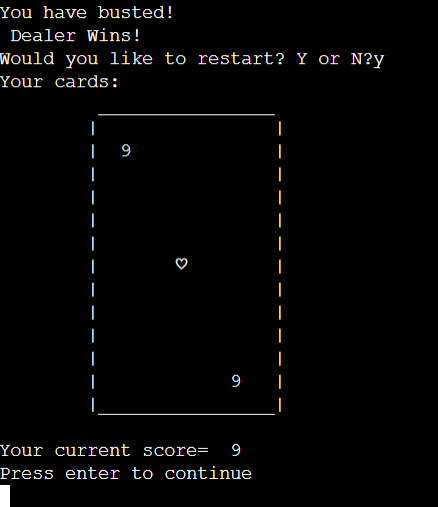

# Blackjack!
This is a simple Blackjack game i have built, running on the code institute mock terminal via heroku. 
The goal of the game is to get a total card value of 21, while competeing against the dealer. The first to get 21, or as close to it as possible will win. However, if either party gets a total over 21, they will bust immediately losing! 

The app can be viewed at https://blackjack-jmp.herokuapp.com

## Author
Jake McParland

## Table of Contents
Generate after readme is complete for UX and below

## How To Play/Use
- When started, the user will need to cycle through the dealer handing out cards by pressing enter, 2 for the player and 2 for the dealer. 
- After the dealing, the user will need to decide to either hit using the "H" key or stand using the "S" key when prompted. The user will need to choose what to do based on their current total card value. 
-Choosing hit will draw another card for the player, while choosing stand will end the players turn and allow the dealer to reveal his hidden card and decide the winner. 
- Once the game reaches its conclusion after validating a blackjack, or a winning score, the option to restart will be offered to the player. 
The Player can enter "Y" to reset the hand or "N" to quit the game. 

## Features

### Implemented Features
- Score tracking : As you play the program stores and manages the players score and the dealers score allowing a winner to be chosen.

- User input for decision making : The gane requires the user to interact rather simply to progress through the game. 

- A restart function : A function was added to allow multiple hands to be played in a row rather than just one. 

### Future Features
- Additional players to compete with 
- Multiple decks
- Online Multiplayer 
- Bet function 

## Data Model
For the data model in this project we generate a deck of cards in the Card class, and then assign both a number and unicode value. 

This data is passed through to the Blackjack function and a card is randomly drawn at specific intervals from this deck. 

Once a card has been selected from the deck, it is simultaneously removed from the deck as it would be in a game of blackjack. 

## Testing

- Tested in my local terminal and on the heroku deployment with no issues
- Tested on pep8online.com for pep8 compliance, with any errors found being fixed.
- Giving user input prompts unlisted answers to test input validation worked perfectly. 

## Bugs
### solved bugs
- Cards not generating correctly
- score being handled incorrectly 
- Restart function had several versions based on mostly lack of experience. 
### remaining bugs 
- If too many small value cards are printed they will start to crossover each other on small screens, Will be fixed by implementing GUI. 
- When restart function is handed non-determined input, it will validate as wrong and then continue to take the "N" argument as the selection. 

### validation testing 
- PEP8 = http://pep8online.com

## Deployment
### Heroku
- I created a Heroku account and began by clicking create new app
- I named the app "Blackjack-jmp", and set the region to Europe
- Once the app was created, i then linked my heroku and github accounts 
- I then proceeded to the settings tab and entered a config var of port : 8000, as well as adding the python and nodeJS buildpacks in that order
- With access to my github through heroku, i selected my project repository which also contains the code institute heroku template and choose to automatically deploy the site so it will update with any changes made to my repository. 

## Credits
-[Code Institute Template](https://github.com/Code-Institute-Org/python-essentials-template)
    - The Template for the GUI for this project was provided by Code Institute. This allows for the Command line to be shown and used within the browser.

-[Askpython blackjack game example](https://www.askpython.com/python/examples/blackjack-game-using-python)
    - The example game i coded along with. 
-Stackoverflow for various bug fixes and ideas. 

